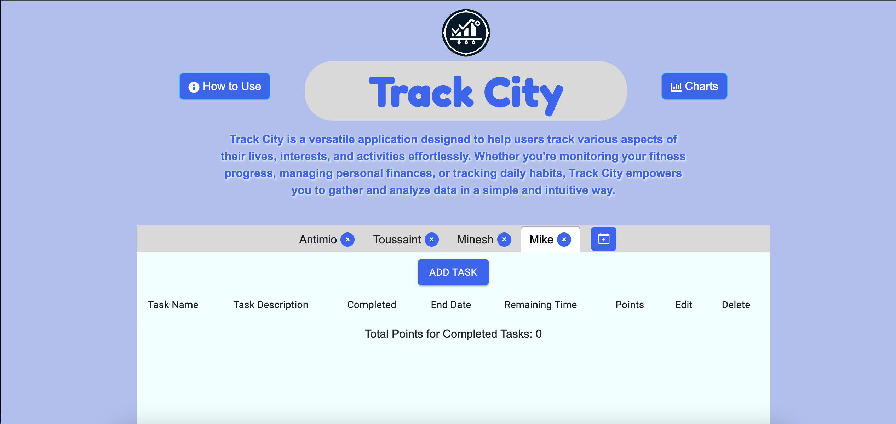

# Track City

[](https://opensource.org/licenses/MIT)

Track City is a versatile application designed to help users track various aspects of their lives, interests, and activities effortlessly. Whether you're monitoring your fitness progress, managing personal finances, or tracking daily habits, Track City empowers you to gather and analyze data in a simple and intuitive way.

## Features

- **Add multiple schedules:** You can easily add multiple schedules to manage many workloads simultaneously!
- **Data Entry and Management:** Easily input data related to the selected schedule using intuitive ftables and interfaces.
- **Visual Data Representation:** Gain valuable insights into your progress and trends with interactive charts and tables.
- **Download and share schedules:** Use our download pdf function to share schedules with everyone and make sure they stay on task!

## Screenshots




## Getting Started

To get started with Track City, follow these steps:

1. To contribute to Track City or review the repository locally, you can use git clone.
2. Use npm install to ensure all dependencies are available
3. Use npm run dev to view Track City locally

## Libraries

* MUI
* Chart.js
* HTML2Canvas
* jspdf


## Deployment

Track City is deployed on [Netlify](https://www.netlify.com/) and can be accessed [here](https://track-city.netlify.app/).


## Contributors

* Toussaint Phillips: https://github.com/ToussaintPhillips
* Minesh Parekh: https://github.com/minyyds
* Chersilnt Ntervisi: https://github.com/CNtervisi
* Antimio Casimiro: https://github.com/Antimio
* Mike Friel: https://github.com/MichaelFriel
 
## License

This project is licensed under the [MIT License](https://opensource.org/licenses/MIT).
```


